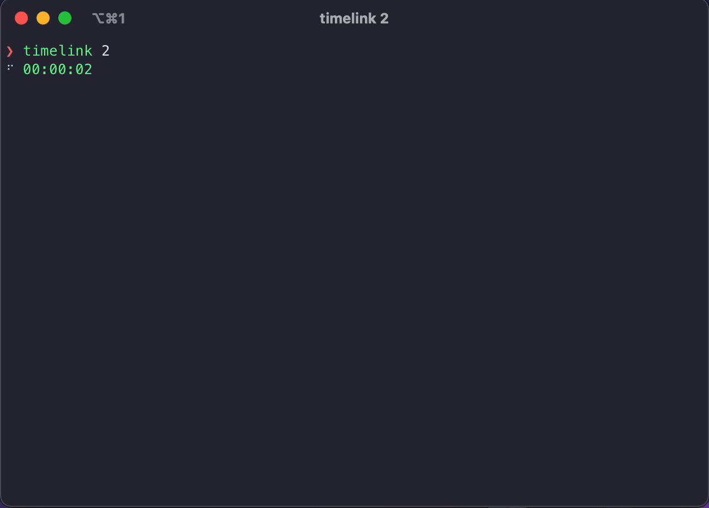

# Timelink ⏰🔗

The timer that runs everywhere and keeps you synchronized! (Not yet, but that's the plan.)

## Installation

Requirements: Install Node.js and npm.

1. Run `npm install -g timelink`

## Usage

- Seconds: `timelink 10`
- Minutes: `timelink 1:00`
- Hours: `timelink 1:00:00`

## Roadmap

- Improve notifications:
  - Notifications can be difficult due to the infinite combinations of devices, terminals, and settings. Currently, I am using native notifications with node-notifier, which is impressive and great. However, the notifications it produces are limited and do not consistently work on all machines based on my tests.
- Add additional platforms and synchronize them with each other.
  - Web
  - iOS
  - MacOS
